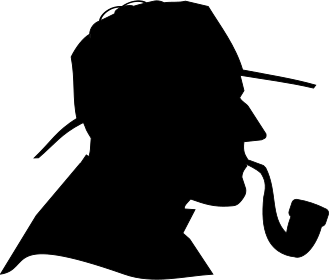

# Dot-to-Dot Generator

Converts silhouette SVGs to dot-to-dog SVGs.

## Usage

```
usage: dot2dot [-h] [--font_scale FONT_SCALE] [--min_dist MIN_DIST]
               [--max_hint_len MAX_HINT_LEN] [--oversample OVERSAMPLE]
               filename

Generate Dot-to-Dot SVG files

positional arguments:
  filename              Input SVG file from which the Dot-to-Dot is generated

optional arguments:
  -h, --help            show this help message and exit
  --font_scale FONT_SCALE
                        Increase or decrease font size. A floating-point
                        value; default is 1.
  --min_dist MIN_DIST   Minimum distance between consecutive points. Default
                        is 10.
  --max_hint_len MAX_HINT_LEN
                        Paths shorter than this number of nodes will be kept
                        as hints, not combined into the main path.
  --oversample OVERSAMPLE
                        Number of points to add between nodes to better
                        capture curves in the input SVG.
```

## Examples

### Input



### Output


